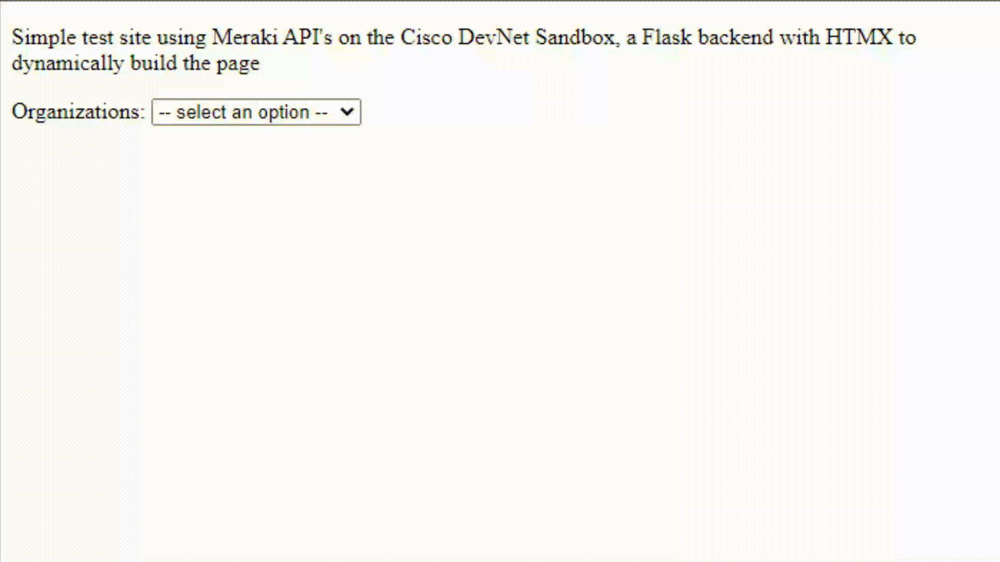

# Meraki Flask HTMX

Simple example using the Cisco Devnet Sandbox Always On Meraki Lab, Flask, and HTMX to dynamically build a page based on user selection and pulling in data from remote api calls

usage ensure create environmental variable `MERAKI_DASHBOARD_API_KEY` with your API key (or a .env file)

results:

